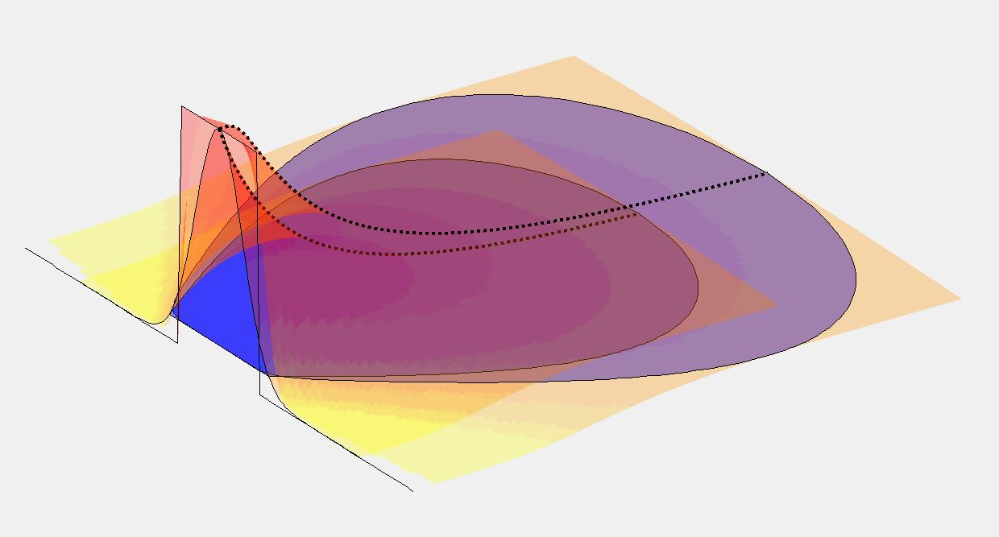

# Introduction
Brooks model uses a 'top hat' starting distribution, i.e. uniform concentration across the initial width, $B$. But this may be overly conservative since the plume is better represented by Gaussian following Initial Dilution, with peak concentration at the centre of the boil and tailing off to the sides. 

We want to redo his analysis but with starting distribution
$$C(0,y)=C_0e^{-\frac{y^2}{2\sigma^2}}$$
such that  $B^2=12\sigma^2$. 
i.e.
$$C(0,y)=C_0e^{-\frac{6y^2}{B^2}}$$
The definite integral of this from $\pm\infty$ is $BC_0\sqrt{\frac{\pi}{6}}$

# Gaussian basics
[https://ocw.mit.edu/courses/1-061-transport-processes-in-the-environment-fall-2008/fa6d07c2884cc8b4d0085cdf3a0d7dba_diffusion.pdf]

Consider spreading of particles released at $x=0$ at $t=0$. The concentration at $(x,t)$ is:

$$C(x,t)=\frac{M}{\sqrt{2\pi\sigma^2}}e^{-\frac{x^2}{2\sigma^2}}=\frac{M}{\sqrt{4\pi\varepsilon t}}e^{-\frac{x^2}{4\varepsilon_0t}}$$
where $\sigma=\sqrt{2\varepsilon_0t}$

The plume mass is given by the zero'th moment:
$$M=\int_{-\infty}^{\infty}C(x,t)dx = \frac{1}{\sqrt{4\pi\varepsilon t}}\int_{-\infty}^{\infty}e^{-\frac{x^2}{4\varepsilon t}}dx=1$$
i.e. the factor $\frac{1}{\sqrt{4\pi\varepsilon t}}$ was chosen to normalise the plume mass. 

NB concentration here is defined in terms of mass/length. To get correct concentration in 3d space, we need to divide by the neglected dimensions.  

The width of the patch is given by the variance:
$$\sigma^2=\frac{\int_{-\infty}^{\infty}x^2C(x,t)dx}{\int_{-\infty}^{\infty}C(x,t)dx}=\frac{\int_{-\infty}^{\infty}x^2e^{-\frac{x^2}{4\varepsilon t}}dx}{\int_{-\infty}^{\infty}e^{-\frac{x^2}{4\varepsilon t}}dx}$$

Here:
https://cushman.host.dartmouth.edu/courses/engs43/Chapter2.pdf
the variance is defined as 

$$\sigma^2=\frac{1}{M}\int_{-\infty}^{\infty}(x-\bar{x})^2Cdx$$
where
$$M=\int_{-\infty}^{\infty}Cdx, \bar{x}=\frac{1}{M}\int_{-\infty}^{\infty}xCdx$$

# Mass vs Concentration
For the top hat starting patch, the mass (per unit length) was 
$M=C_0B$.
Here, we want to specify the initial peak concentration $C_0$ for a Gaussian plume. For this, we require $M=C_0\sqrt{2\pi\sigma^2}$. 
Noting that $B=\sqrt{12}\sigma$, the mass is:

$$M=C_0\sqrt{\frac{2\pi B^2}{12}}=C_0B\sqrt{\frac{\pi}{6}}$$

The mass of the Gaussian plume is therefore ~0.72x the mass of the top-hat patch (even though it is infinite in extent!).

# Reformulation of Gaussian plume
The above discussion assumed an instantaneous release at $t=0$. But we assume the we've already got a Gaussian plume and are interested in how that spreads, with non-constant $\varepsilon$. 

Translating the above so that spreading is in the $y$ direction gives:

$$C(y,t)=\frac{M}{\sqrt{4\pi\varepsilon t}}e^{-\frac{y^2}{4\varepsilon_0t}}$$

Subsituting the value for $M$ determined above:

$$C(y,t)=\frac{C_0B\sqrt{\frac{\pi}{6}}}{\sqrt{4\pi\varepsilon t}}e^{-\frac{y^2}{4\varepsilon_0t}}=\frac{C_0B}{\sqrt{24\varepsilon t}}e^{-\frac{y^2}{4\varepsilon_0t}}$$

Expressing in terms of $U$ and $t$, and replacing constant $\varepsilon_0$ with spatially-varying $\varepsilon$:

$$C(x',y)=\frac{M}{\sqrt{4\pi\varepsilon_0x'/U}}e^{-\frac{Uy^2}{4\varepsilon_0x'}}=\frac{C_0B}{\sqrt{24\varepsilon_0x'/U}}e^{-\frac{Uy^2}{4\varepsilon_0x'}}$$

This has a maximum value at $y=0$ of 

$$C(x',0)=M\sqrt{\frac{U}{4\pi\varepsilon_0x'}}$$

In terms of $\beta=\frac{12\varepsilon_0}{UB}$, this is

$$C(x',0)=M\sqrt{\frac{3}{\pi\beta Bx'}}=C_0B\sqrt{\frac{1}{2\beta Bx'}}$$

# Transformation from $x'$ to $x$
As before, we start by calculating the variance of the patch, defined as 

$$\sigma(x')^2=\frac{1}{M}\int_{-\infty}^{\infty}y^2C(x',y)dy$$

Substituting our value for $C(x',y)$:

$$\sigma(x')^2=\frac{1}{M}\int_{-\infty}^{\infty}\frac{M}{\sqrt{4\pi\varepsilon_0x'/U}}y^2e^{-\frac{Uy^2}{4\varepsilon_0x'}}dy$$

Taking the terms not containing $y$ outwith the integral:

$$\sigma(x')^2=\frac{1}{\sqrt{4\pi\varepsilon_0x'/U}}\int_{-\infty}^{\infty}y^2e^{-\frac{Uy^2}{4\varepsilon_0x'}}dy$$

$$\sigma(x')^2=\frac{1}{\sqrt{4\pi\varepsilon_0x'/U}}\left[\frac{4 \sqrt{\pi} \, x'^{\frac{3}{2}} {\varepsilon}_{0}^{\frac{3}{2}}}{U^{\frac{3}{2}}}\right]$$

$$\sigma(x')^2=\frac{2x'\varepsilon_0}{U}=\frac{x'\beta B}{6}$$

Replace $\sigma(x)$ by $L(x')/\sqrt{12}$:

$$\frac{L(x)^2}{12}=\frac{x'\beta B}{6} $$

$$\Rightarrow \frac{L(x)^2}{B^2}=\frac{2x'\beta }{B} $$

$$\Rightarrow\frac{L(x)}{B}=\left(\frac{2\beta x' }{B}\right)^{\frac{1}{2}}$$

Substitute in expression for $dx'$:

$$ \frac{dx'}{dx}=\left(\frac{L(x)}{B}\right)^n=\left(\frac{2\beta x'}{B}\right)^{\frac{n}{2}}$$

Rearranging and integrating:

$$\int dx=\int\left(\frac{2\beta x'}{B}\right)^{-\frac{n}{2}}dx'$$

$$\Rightarrow x=\frac{2^{\frac{2-n}{2}}x'}{(2-n)\left(\frac{\beta x'}{B}\right)^{\frac{n}{2}}}+c$$

where $c$ is the constant of integration.

$$\Rightarrow x=\frac{2x'^{\frac{2-n}{2}}}{(2-n)\left(\frac{2\beta}{B}\right)^{\frac{n}{2}}}+c$$

$$\Rightarrow x'^{\frac{2-n}{2}}=\frac{(2-n)}{2}\left(\frac{2\beta}{B}\right)^{\frac{n}{2}}(x-c)$$

$$\Rightarrow x'=\left(\frac{(2-n)}{2}\left(\frac{2\beta}{B}\right)^{\frac{n}{2}}(x-c)\right)^{\frac{2}{2-n}}$$

$$\Rightarrow x'=\left(\frac{(2-n)}{2}\left(\frac{B}{2\beta}\right)^{-\frac{n}{2}}(x-c)\right)^{\frac{2}{2-n}}$$

$$\Rightarrow x'=\left(\frac{(2-n)}{2}\left(\frac{B}{2\beta}\right)^{-1}\left(\frac{B}{2\beta}\right)^{\frac{2-n}{2}}(x-c)\right)^{\frac{2}{2-n}}$$

$$\Rightarrow x'=\left(\frac{(2-n)}{2}\left(\frac{2\beta}{B}\right)\left(\frac{B}{2\beta}\right)^{\frac{2-n}{2}}(x-c)\right)^{\frac{2}{2-n}}$$

$$\Rightarrow x'=\frac{B}{2\beta}\left(\frac{(2-n)\beta x}{B}-c\right)^{\frac{2}{2-n}}$$

(Note that $c$ is changing in rearrangements above; we'll sort below).
## Plume width
Expression for $L(x)/B$:
$$\frac{L(x)}{B}=\left(\frac{2\beta x' }{B}\right)^{\frac{1}{2}}=\left(\frac{(2-n)\beta x }{B}-c\right)^{\frac{1}{2-n}}$$

This ratio must be 1 at $x=0$, so $c=-1$ and we have 

$$\boxed{x'=\frac{B}{2\beta}\left(\frac{(2-n)\beta x}{B}+1\right)^{\frac{2}{2-n}}}$$

$$\boxed{\frac{L(x)}{B}=\left(\frac{(2-n)\beta x }{B}+1\right)^{\frac{1}{2-n}}}$$

**This is the same expression as for the top-hat start!**

## Peak Concentration

$$C(x',0)=C_0B\sqrt{\frac{1}{2\beta Bx'}}$$

Using our expression for $x'$:

$$C(x,0)=C_0B\sqrt{\frac{1}{2\beta B\frac{B}{2\beta}\left(\frac{(2-n)\beta x}{B}+1\right)^{\frac{2}{2-n}}}}$$

$$C(x,0)=C_0\sqrt{\frac{1}{\left(\frac{(2-n)\beta x}{B}+1\right)^{\frac{2}{2-n}}}}$$

The peak concentration at a distance $x$ downstream is then:

$$\boxed{C(x,0)=C_0\left(\frac{(2-n)\beta x}{B}+1\right)^{\frac{1}{n-2}}}$$

Compare this with the original Brooks equation (which had a constant 'top-hap' starting concentration):

$$\boxed{C(x,0)=C_0\operatorname{erf}\left(\left[\frac{2 }{3}\left(\left(\frac{(2-n)\beta x}{B} +1\right)^{\frac{2}{2-n}}-1 \right)\right]^{-\frac{1}{2}}\right)}$$

The 'Gaussian' version dilutes more rapidly. A comparison plot with the 'top-hat' starting concentration is shown below for a dilution of 10x:

The 'top-hat' plume is around 70% bigger.

