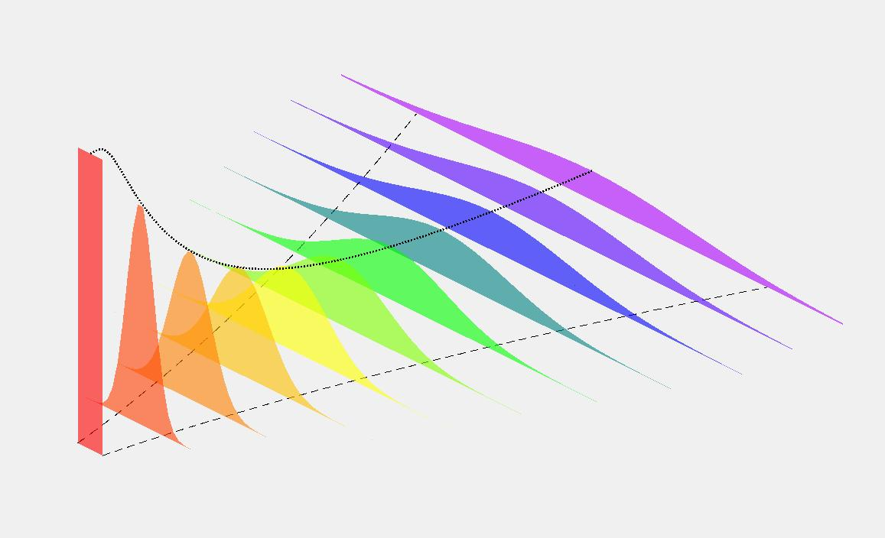

# Brooks model

Brooks considered the spreading of an extended plume of width $B$ in a uniform ambient current, $U$ m/s in the $x$ direction.

The plume advects in the $x$ direction, with minimal longitudinal dispersion. 

The plume disperses laterally as described by the diffusion equation:

$$\frac{\partial C}{\partial t} = \varepsilon\frac{\partial^2 C}{\partial y^2}\tag{1}$$

where $\varepsilon$ is the diffusion coefficient with units $m^2/s$. 

A plot of the plume spread is shown below:

Noting that $U=\frac{x}{t}$, the diffusion equation can be expressed as:

$$U\frac{\partial C}{\partial x} = \varepsilon\frac{\partial^2 C}{\partial y^2\tag{2}}$$

If $\varepsilon$ is constant, then the diffusion equation above is the classical heat equation and can be readily solved. One solution, for example, is the Gaussian distribution:

$$C(y,t)=\frac{C_0}{\sqrt{4\pi\varepsilon t}}e^{-\frac{y^2}{4\varepsilon t}}$$

or 

$$C(x,y)=\frac{C_0\sqrt{U}}{\sqrt{4\pi\varepsilon x}}e^{-\frac{Uy^2}{4\varepsilon x}}$$

However, there is extensive evidence from field data that the dispersion coefficient is not uniform but rather increases with the size of the dispersing plume. 

Brooks therefore considered a time/spatially varying dispersion coefficient

$$\varepsilon=\varepsilon_0f(x)$$

where $\varepsilon_0$ is the coefficient at $x=t=0$ and $f(x)$ is some function relating the two. 

Now the diffusion equation is:

$$\frac{U}{f(x)}\frac{\partial C}{\partial x} = \varepsilon_0\frac{\partial^2 C}{\partial y^2}$$

Brooks defined a new variable $x'$ such that $dx' = f(x)dx$, so the diffusion equation becomes:

$$U\frac{\partial C}{\partial x'} = \varepsilon_0\frac{\partial^2 C}{\partial y^2}$$

This is the classical heat equation (i.e. constant dispersion coefficient) defined in terms of a transformed $x$ coordinate. 

Quantifying the spatially-varying concentration field in terms of $x$ then requires two stages:
1. Solve the diffusion equation in terms of $x'$
2. Transform the solution found above back to the original coordinate $x$

# Solution of Diffusion Equation
For a point source, the solution of the heat equation is a Gaussian:

$$C(x,y)=\frac{C_0\sqrt{U}}{\sqrt{4\pi\varepsilon x}}e^{-\frac{Uy^2}{4\varepsilon x}}$$

For a line source centred at $y=0$ and width $B$, the concentration is a superposition of point sources:

$$C(x',y)=\frac{C_0}{\sqrt{4\pi\varepsilon_0x'/U}}\int_{-B/2}^{B/2} e^{-\frac{U(y-y')^2}{4\varepsilon_0x'}}dy'$$

Note that this assumes uniform concentration between $\pm B$, and zero concentration elsewhere. The solution of this is:

$$C(x',y)=\frac{C_0}{2}\left(\mathrm{erf}\left(\frac{\sqrt{U} \left(B+2y\right)}{4\sqrt{{x'\varepsilon_{0}}}}\right) + \mathrm{erf}\left(\frac{\sqrt{U} \left(B - 2y\right)}{4\sqrt{x'\varepsilon_{0}}}\right)\right)
$$

which has a maximum value at $y=0$:

$$C(x',0)=C_0\mathrm{erf}\left(\frac{U B}{4\sqrt{{Ux'\varepsilon_{0}}}}\right)$$

Using the subsitution $\beta=\frac{12\varepsilon_0}{UB}$, the peak concentration is:

$$C(x',0)=C_0\mathrm{erf}\left(\sqrt{\frac{3 B}{4\beta x'}}\right)$$

# Transformation from $x'$ to $x$

The transformation that allowed us to solve the diffusion equation was
$$f(x)=\frac{dx'}{dx}=\frac{\varepsilon}{\varepsilon_0}$$

Brooks assumed that the diffusion coefficient varied with $x$ as:
$$\varepsilon=\alpha L(x)^n$$
where $L$ denotes the plume width.
The starting plume with at $x=0$ is $B$, so
$$\varepsilon_0=\alpha B^n$$

We therefore have:
$$\frac{dx'}{dx}=\left(\frac{L}{B} \right)^n$$

He also assumed that the plume width $L$ was related to the standard deviation of the patch, $\sigma$, as:
$$L=\sqrt{12}\sigma$$

So, by calculating the standard deviation (square root of the variance) at a distance $x$ from the starting point, we can relate $dx$ to $dx'$ and thus determine the transformation from $x'$ to $x$.

The variance of the concentration patch is defined in terms of the second moment:
$$\sigma(x')^2=\frac{1}{C_0B}\int_{-\infty}^{\infty}y^2C(x',y)dy$$

where $C_0B$ is the area of the starting 'mass' used for normalising and
$$C(x',y)=\frac{C_0}{\sqrt{4\pi\varepsilon_0x'/U}}\int_{-B/2}^{B/2} e^{-\frac{U(y-y')^2}{4\varepsilon_0x'}}dy'$$

The solution of this is:
$$C(x',y)=\frac{C_0}{2}\left(\mathrm{erf}\left(\frac{\sqrt{U} \left(B+2y\right)}{4\sqrt{{x'\varepsilon_{0}}}}\right) + \mathrm{erf}\left(\frac{\sqrt{U} \left(B - 2y\right)}{4\sqrt{x'\varepsilon_{0}}}\right)\right)
$$

Substituting into the variance equation, we get
$$\sigma(x')^2=\frac{1}{2B}\int_{-\infty}^{\infty}y^2\left(\mathrm{erf}\left(\frac{\sqrt{U} \left(B+2y\right)}{4\sqrt{{x'\varepsilon_{0}}}}\right) + \mathrm{erf}\left(\frac{\sqrt{U} \left(B-2y\right)}{4\sqrt{x'\varepsilon_{0}}}\right)\right)dy$$

`y^2*(erf(sqrt(U)*(B+2y)/(4*sqrt(x*epsilon_0)))+erf(sqrt(U)*(B-2y)/(4*sqrt(x*epsilon_0))`

This was solved by https://www.integral-calculator.com/# for the equation 
$y^2*(\mathrm{erf}(A*(B+2y))+\mathrm{erf}(A*(B-2y)))$
where $A=\frac{\sqrt{U}}{4\sqrt{x'\varepsilon}}$ (version with $x'$, $\sqrt{U}$ etc failed on above website)
The solution of the equation above is:
$$ \frac{2A^2B^3+3B}{12A^2}=\left[\frac{B^3}{6}+\frac{4x'\varepsilon_0B}{U} \right]$$
Plugging this into the variance equation gives:
$$\sigma(x')^2=\frac{1}{2B}\left[\frac{B^3}{6}+\frac{4x'\varepsilon_0B}{U} \right]$$

Using the substitution $\beta=\frac{12\varepsilon_0}{UB}$, this becomes:
$$\sigma(x')^2=\frac{B^2}{12}\left(1+\frac{2\beta x'}{B} \right)$$

Replace $\sigma(x)$ by $L(x')/\sqrt{12}$, and divide both sides by $B$:
$$\frac{L(x')}{B}=\left(1+\frac{2\beta x'}{B} \right)^{\frac{1}{2}}$$

Using the relationship $\frac{dx'}{dx}=\left(\frac{L}{B} \right)^n$, we get:
$$\frac{dx'}{dx}=\left( \frac{2\beta x'}{B}+1\right)^{\frac{n}{2}}$$

Rearranging and integrating both sides:

$$x=\int \frac{1}{\left(\frac{2\beta x'}{B} + 1\right)^{\frac{n}{2}}} \, \mathrm{d}x' =\frac{2{\beta}x' + B}{\left(2-n\right) {\beta} \cdot \left(\frac{2{\beta}x' + B}{B}\right)^{\frac{n}{2}}}+C$$
where $C$ is the constant of integration.

*Aside - https://www.integral-calculator.com/# provides steps; start by substituting $u=\frac{2\beta x}{B}+1 \rightarrow du=\frac{2\beta}{B}dx$* 

Rearrange equation above in terms of $x'$ (e.g. by using the substitution $u=\frac{2\beta x'+B}{B}$) and we get 

$$x'=\frac{B}{2\beta}\left(\left(\frac{(2-n)\beta x}{B} -C\right)^{\frac{2}{2-n}}-1 \right)$$

Since $x=x'$ at $x=0$, $C=-1$ and the equation above becomes

$$x'=\frac{B}{2\beta}\left(\left(\frac{(2-n)\beta x}{B} +1\right)^{\frac{2}{2-n}}-1 \right)$$

Substitute this into peak concentration (which was found in terms of $x'$, i.e.$C(x',0)=C_0\mathrm{erf}\left(\sqrt{\frac{3 B}{4\beta x'}}\right)$) leads to the concentration we want, in terms of $x$:

$$\boxed{C(x,0)=C_0\mathrm{erf}\left(\left[\frac{2 }{3}\left(\left(\frac{(2-n)\beta x}{B} +1\right)^{\frac{2}{2-n}}-1 \right)\right]^{-\frac{1}{2}}\right)}$$

# Plume Width
The plume width can be calculated by substituting our expression for $x'$ into the equation for $L(x')$:

$$\boxed{L(x)=B\left(1+\frac{(2-n)\beta x}{B} \right)^{\frac{1}{2-n}}}$$

The concentration at the plume edge can be determined by considering the Gaussian distribution in terms of $\sigma$, ignoring constants:
$$C(y)=e^{-\frac{y^2}{2\sigma^2}}$$
The plume edge corresponds to $\frac{L}{2}=\sqrt{3}\sigma$, so the edge concentration is $e^{-1.5}$ of the peak concentration, $\approx 0.22C_p$.

# Values of $n$
Brooks considered 3 values of $n$ which apply in different flow regimes:
- $n=0$ - constant turbulent diffusion
- $n=1$ - applicable in coastal/estuarine waters
- $n=\frac{4}{3}$ - Richardson diffusion, found to represent dispersion in the open ocean

Peak concentrations and plume widths for these values of $n$ are tabulated below. 
|$n$|Plume Width $\frac{L}{B}$|Peak Concentration $\frac{C_{max}}{C_0}$|
|-|-|-|
|0|$\left[1+\frac{2\beta x}{B} \right]^{\frac{1}{2}}$|$\mathrm{erf}\left(\left[\frac{2 }{3}\left(\frac{2\beta x}{B} \right)\right]^{-\frac{1}{2}}\right)$
|1|$\left[1+\frac{\beta x}{B} \right]$|$\mathrm{erf}\left(\left[\frac{2 }{3}\left(\left(\frac{\beta x}{B} +1\right)^{2}-1 \right)\right]^{-\frac{1}{2}}\right)$
|$\frac{4}{3}$|$\left[1+\frac{2\beta x}{3B}\right]^{\frac{3}{2}}$|$\mathrm{erf}\left(\left[\frac{2 }{3}\left(\left(\frac{2\beta x}{3B} +1\right)^{3}-1 \right)\right]^{-\frac{1}{2}}\right)$

As expected, the plume expands and dilutes more rapidly for larger $n$. Also, recalling that $\beta=\frac{12\varepsilon_0}{UB}$, we can see that the plume disperses more quickly when $U$ and/or $B$ is small. 

Small ambient current speeds give the plume more time to spread before reaching a given distance, $x$. For larger patches (greater $B$), the plume is spreading into itself to a greater degree, so additional spreading at the edges is slower.

This latter point may suggest that small plumes are preferable; however in reality we are interested in the total dilution (Initial Dilution combined with Brooks), and a small patch indicates low ID.

# Implementation of Brooks model
The Brooks model is used to calculate the secondary mixing of effluent following Initial Dilution. 

The secondary dilution is the reciprocal of the normalised peak concentration tabulated above. The parameters used in the calculation are:

|Parameter|Value|Comment|
|-|-|-
|$n$|$\frac{4}{3}$|Implementation of Brooks model in Visual Plumes used this exponent
|$B$|$0.76H$|$H$ is the water depth; relationship between depth and plume width depends on ambient current speed as discussed in WRc paper. 0.76 value used in EA spreadsheet
|$\alpha$|$0.0003m^{2/3}/s$|This parameter has units which depend on $n$; this is the default value in Visual Plumes ($n=\frac{4}{3}$), somewhat more conservative than the $0.01cm^{2/3}/s$ value noted in Brooks's paper. 
|$\varepsilon_0$|$\alpha B^n$|Calculated using values above|
|U|From data|Typical value (mean of submitted hydrographic datasets) is ~0.1m/s. Recommend undertaking sensitivity analysis of this parameter.
|x|100m|Distance to edge of mixing zone
|$D$|Dilution = $\frac{C_{max}}{C_0}$|1/$\mathrm{erf}\left(\left[\frac{2 }{3}\left(\left(\frac{2\beta x}{3B} +1\right)^{3}-1 \right)\right]^{-\frac{1}{2}}\right)$ for $n=\frac{4}{3}$

# EQS Assessment
We may be interested in the plume area which exceeds a given concentration. 

First of all, we need to establish the distance at which the required dilution is achieved. This can be done by rearranging the equation for peak concentration:
$$C(x,0)=C_0\mathrm{erf}\left(\left[\frac{2 }{3}\left(\left(\frac{(2-n)\beta x}{B} +1\right)^{\frac{2}{2-n}}-1 \right)\right]^{-\frac{1}{2}}\right)$$

$$D=\frac{C_0}{C(x,0)}=1/\mathrm{erf}\left(\left[\frac{2 }{3}\left(\left(\frac{(2-n)\beta x}{B} +1\right)^{\frac{2}{2-n}}-1 \right)\right]^{-\frac{1}{2}}\right)$$

$$\rightarrow  \boxed{x =\frac{B}{(2-n)\beta}\left[\left(\frac{3 }{2}\left(\mathrm{ierf}\left(\frac{1}{D}\right)\right)^{-2}+1\right)^{\frac{2-n}{2}}-1\right]}$$
At this distance, the peak concentration has reduced by the required dilution. 

At intermediate distances, we also need to calculate the plume width at which the required dilution is achieved. 

$$D=\frac{C_0}{C(x',y)}=2/\left(\mathrm{erf}\left(\frac{\sqrt{U} \left(B+2y\right)}{4\sqrt{{x'\varepsilon_{0}}}}\right) + \mathrm{erf}\left(\frac{\sqrt{U} \left(B - 2y\right)}{4\sqrt{x'\varepsilon_{0}}}\right)\right)
$$
which must be solved numerically for $y$.

We can generate a polygon of these values which define the zone within which the dilution $D$ has not been reached yet. 

Or we could contour the 2d concentration field...

$S_2=\mathrm{erf}\left(\left[\frac{2 }{3}\left(\left(\frac{2\beta x}{3B} +1\right)^{3}-1 \right)\right]^{-\frac{1}{2}}\right)^{-1}$

# References

*DIFFUSION OF SEWAGE EFFLUENT IN AN OCEAN - CURRENT* Norman H. Brooks. Proceedings of the First International Conference on Waste Disposal in the Marine Environment 1960 pp246-267

*Sea Outfall Design Prediction of Initial Dilution*, ER 350E, Editors M McNaMara and K Strange, November 1988
